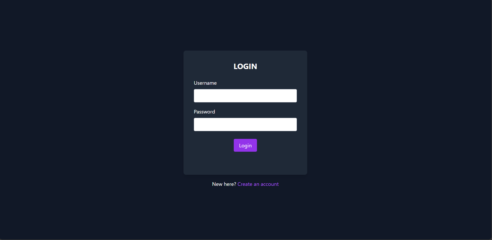
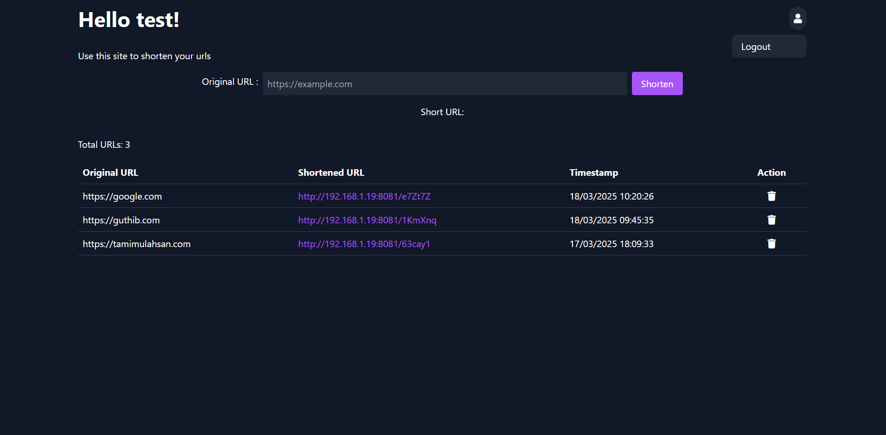

# Self Hosted URL Shortener with Login/Signup
Tested on ubuntu 24.04 LTS

## Features
- User registration and login
- Email verification
- URL shortening and redirection
- User dashboard to view and manage shortened URLs


## Requirements

1. **Python 3:** `django`, `mysql-client`, `django-restframework`, `bcrypt`, `gunicorn`, `dotenv`, `validators`
2. **MySQL Server**
3. **Nginx**
4. **php-fpm**

---

## Installation

#### Install Python, Nginx, and MySQL Server

```sh
sudo apt install python3 mysql-server nginx php-fpm
```

#### Setup and activate a Python Virtual Environment

```sh
python3 -m venv /path/to/virtual-environment
source /path/to/virtual-environment/bin/activate
```

#### Install Required Libraries

```sh
pip install -r requirements.txt
```

If you encounter issues installing `mysqlclient`, install development headers and libraries:

```sh
sudo apt-get install python3-dev default-libmysqlclient-dev build-essential
```

#### Start and Enable MySQL Server at Startup

```sh
sudo systemctl start mysql
sudo systemctl enable mysql
```

### Secure MySQL Installation and Set Up Root Password

```sh
sudo mysql_secure_installation
```

### Create a Database and User for Django

```sh
sudo mysql -u root -p
```

```sql
CREATE DATABASE url_shortener_db;
CREATE USER 'django_user'@'localhost' IDENTIFIED BY 'yourpassword';
GRANT ALL PRIVILEGES ON url_shortener_db.* TO 'django_user'@'localhost';
FLUSH PRIVILEGES;
EXIT;
```

### Configure Django Database Settings

Edit `/urlshortener/settings.py` and update the `DATABASES` setting:

```python
DATABASES = {
    'default': {
        'ENGINE': 'django.db.backends.mysql',
        'NAME': 'url_shortener_db',
        'USER': 'django_user',
        'PASSWORD': 'yourpassword',
        'HOST': 'localhost',
        'PORT': '3306',
    }
}
```

Now Django is connected to MySQL and ready for further development.

---

## Starting the Django App

#### Modify Python Code and Routing

Modify the files in `/shortener` and `/urlshortener` as per your requirements.

#### Run Migrations

```sh
python manage.py makemigrations
python manage.py makemigrations shortener
python manage.py migrate
```

#### Create the Database Table for Shortened URLs

```sh
sudo mysql -u root -p
```

```sql
USE url_shortener_db;
CREATE TABLE shortener_shortenedurl (
    id INT AUTO_INCREMENT PRIMARY KEY,
    original_url VARCHAR(2000) NOT NULL,
    short_code VARCHAR(10) NOT NULL UNIQUE,
    user_id VARCHAR(255) NOT NULL,
    created_at DATETIME NOT NULL,
    FOREIGN KEY (user_id) REFERENCES users(unique_id) ON DELETE CASCADE
);
```

#### Configure Allowed Hosts

Edit `/urlshortener/settings.py` and add your allowed hosts.

#### Modify the URL Configuration

Edit `/templates/home.html` to adjust with your hostname for the urlshortener, logout url etc.

#### Create log files
Create log files in `/var/www/urlshortener/` `access.log`,`error.log` 
```sh
sudo touch access.log error.log
```
### Starting and stopping the django app
located at `/urlshortener/app` directory

```sh
sudo ./run_urlshortener.sh
sudo ./kill_urlshortener.sh
```

---

## Setting Up Login/Signup System

#### Create Users Table in MySQL

```sh
sudo mysql -u root -p
```

```sql
USE url_shortener_db;
CREATE TABLE users (
    unique_id VARCHAR(255) PRIMARY KEY,
    username VARCHAR(255) UNIQUE,
    email VARCHAR(255) NOT NULL,
    is_verified TINYINT(1) NOT NULL DEFAULT 0,
    hashed_password VARCHAR(255),
    timestamp DATETIME,
    session_id VARCHAR(255),
    token VARCHAR(255)
);
```

### Modify Session ID and Cookie Handling

Update `/index.php` change the domain, path, and secure settings for the cookie.

### Modify your smtp details for email verification
update `/signup/index.php` and include your stmp server, username, password and the message body to your needs.

### Configure Nginx

Copy the Nginx configuration file to `/etc/nginx/sites-enabled/urlshortener` and restart Nginx:

```sh
sudo systemctl restart nginx
```

---

## Screenshots





